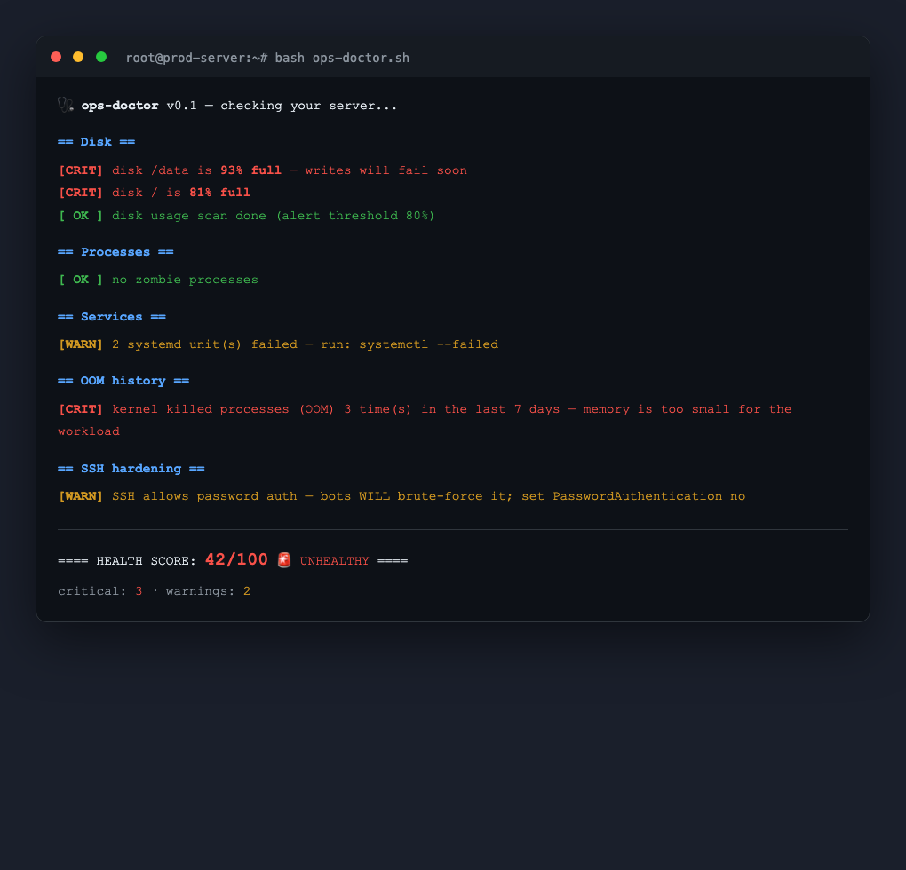

# 🩺 ops-doctor

> **一条命令，给服务器做全套体检。** 无 Agent、无配置、无依赖。

[English](README.md) | 简体中文

```bash
curl -fsSL https://raw.githubusercontent.com/tomlen045/ops-doctor/main/ops-doctor.sh | bash
```

把上面这行贴到任何 Linux 服务器上，立刻得到一份健康报告：**负载、内存、磁盘、inode、僵尸进程、挂掉的 systemd 服务、OOM 击杀记录、待重启标记、SSH 加固**——0-100 健康分，每一条发现都附带"该怎么办"。不是一堆原始数字的堆砌。



## 为什么

服务器不是轰然倒塌的，是悄悄烂掉的。磁盘慢慢爬到 90%，某个服务三周前就挂了，OOM 上周二开始杀进程——`ops-doctor` 在老板问你"网站为什么挂了"之前的 5 秒钟，把这些全部抓出来。

作者发布前在自己 Mac 上跑了一遍，真的查出了没发现的磁盘问题。

## 功能

- **15+ 项检查**：负载、内存/swap、磁盘空间**和 inode**、僵尸进程、失败 systemd 单元、OOM 击杀、待重启、待更新、SSH 加固（root 登录/密码认证）
- **健康分** 0–100 + 退出码（`0` 健康 / `1` 有危重发现）——直接进 cron 或 CI
- **Markdown 报告**：`bash ops-doctor.sh --md report.md`——贴工单、贴 Wiki
- **零依赖**：bash + 系统自带 coreutils，不留任何痕迹
- **隐私**：全部本地运行，不发送任何数据

## 用法

```bash
bash ops-doctor.sh                 # 彩色报告 + 健康分
bash ops-doctor.sh --md report.md  # 额外输出 Markdown 报告
echo $?                            # 0=健康 1=有危重发现
```

### Cron 示例——每周体检报告自动发邮箱

```bash
0 9 * * 1 bash /opt/ops-doctor.sh --md /tmp/report.md && mail -s "weekly server checkup" you@company.com < /tmp/report.md
```

## 兼容性

Linux（主要目标，为服务器设计）· macOS（部分核心检查）

## License

MIT

---

## 🫰 关注「小薅薅」· 每天发现一个宝藏工具

> **小薅薅** — 年轻人的赛博工具箱。每天为你发现一个好玩、实用、开源的小工具，帮你节省 1 小时探索时间。
>
> 📱 **微信搜索「小薅薅」** 或扫描下方二维码关注
>
> 后台回复关键词获取：
> - 回复 **「工具」** → 获取全部工具合集（离线可用）
> - 回复 **「运维」** → 获取运维/安全资源包
> - 回复 **「加群」** → 加入工具交流群

<div align="center">

| 🎯 更多作品 | 描述 | Stars |
|:---|:---|:---|
| [ops-skills](https://github.com/tomlen045/ops-skills) | 10个AI运维技能包，让Claude Code变成SRE专家 | [⭐ 新项目](https://github.com/tomlen045/ops-skills) |
| [shellmbti](https://github.com/tomlen045/shellmbti) | 你的终端历史暴露了你是谁——Shell MBTI人格测试 | [⭐ 病毒传播](https://github.com/tomlen045/shellmbti) |
| [naicha-mbti](https://github.com/tomlen045/naicha-mbti) | 8道题测出你的奶茶人格，生成分享卡片 | [🧋 爆款](https://github.com/tomlen045/naicha-mbti) |
| [fafa-generator](https://github.com/tomlen045/fafa-generator) | 发疯文学生成器——一键生成发疯文案+卡片 | [🔥 热门](https://github.com/tomlen045/fafa-generator) |
| [life-progress](https://github.com/tomlen045/life-progress) | 人生进度条——把你的时间摆在眼前 | [⏳ 走心](https://github.com/tomlen045/life-progress) |

</div>

<div align="center">

**觉得有用？给个 ⭐ 让更多人看到 → [GitHub](https://github.com/tomlen045) | [Gitee](https://gitee.com/tomlen)**

</div>
